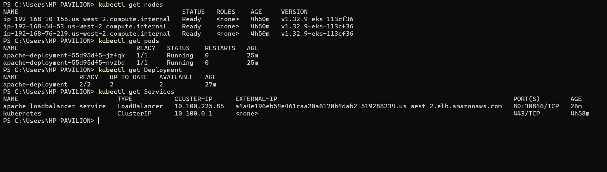
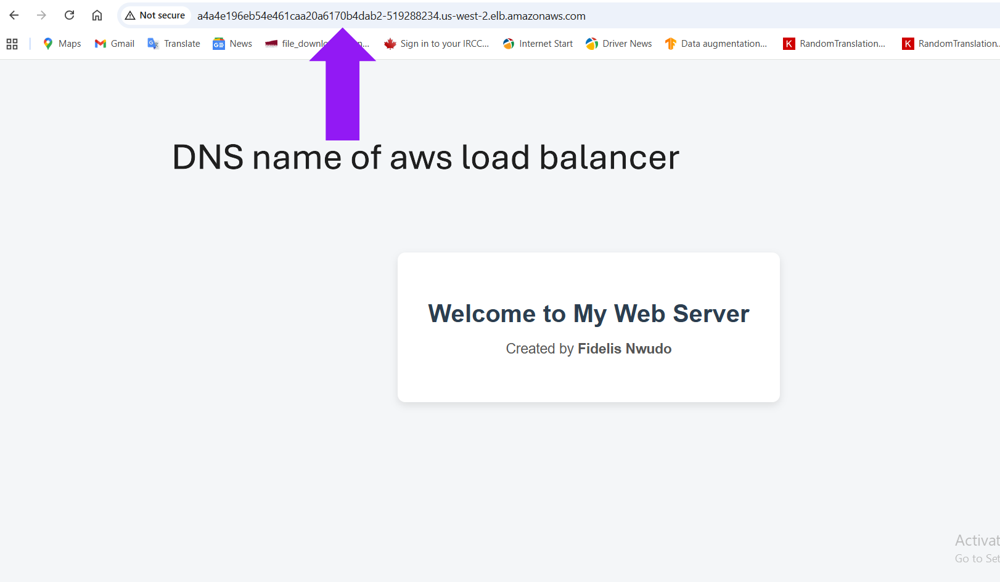

# kubernetes-apache-webapp
Deployment of a containerized Apache web application on an EKS cluster using Kubernetes, featuring a LoadBalancer service and multiple replicas for high availability. It covers the full workflow from containerization to exposing the application externally via a LoadBalancer Service showcasing skills in Docker, Kubernetes deployments, and cloud orchestration.

# Project Objectives

- Containerize an Apache web application using Docker.
- Push the Docker image to Docker Hub.
- Deploy the containerized app to an EKS cluster (named playground-cluster) with 3 nodes in the us-west-2 region.
- Create a Deployment resource with 2 replicas of the Apache Pod for high availability.
- Expose the deployment using a LoadBalancer Service on port 80.

# Technologies Used

- Amazon EKS (Elastic Kubernetes Service)
- Docker & Docker Hub
- YAML (Kubernetes Pod, Deployment and Services Manifests Files)
- AWS CLI

